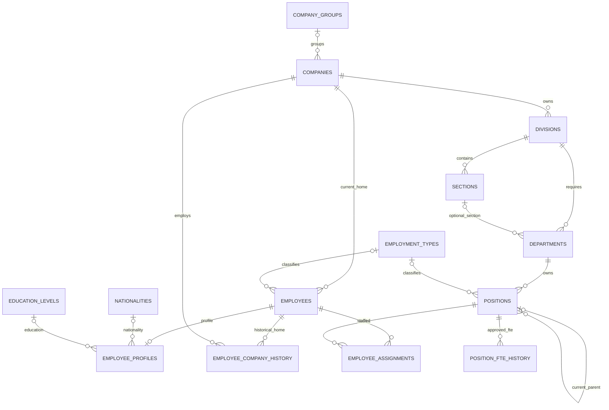
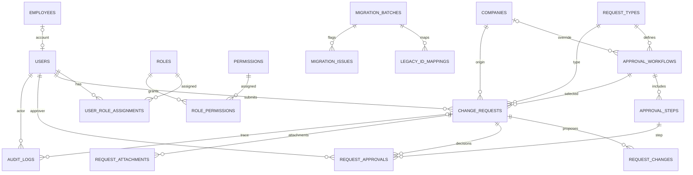
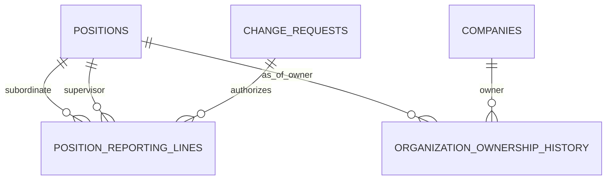

# Roster Master — ER Diagram (R2.1)
Source: baseline `001_schema.sql`; dotted/proposed logical entities described separately. Mermaid represents relationships, not executable SQL or a claim of implemented constraints.

## Existing organization and workforce

## Existing access, approvals, audit and migration

## Proposed R2 logical relationship (NOT IN BASELINE SQL)

Notes: `ORGANIZATION_OWNERSHIP_HISTORY` is a conceptual placeholder; physical normalization (division/department/position effective-dated edges) remains to be decided. `POSITION_REPORTING_LINES` replaces relying solely on current `positions.parent_position_id` for historical cross-company reporting. Approval-step membership, RLS, cycle prevention, aggregate FTE and effective-date integrity are NOT guaranteed by the diagram or baseline SQL. Reporting has separate employee-home and position-owner dimensions and must use historical company lineage for as-of queries.
