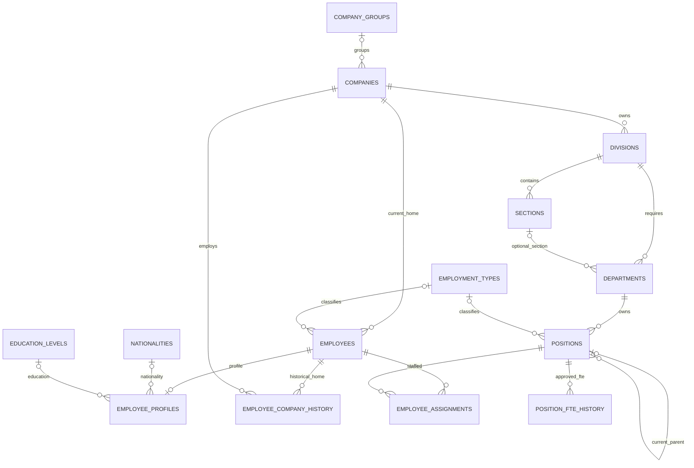
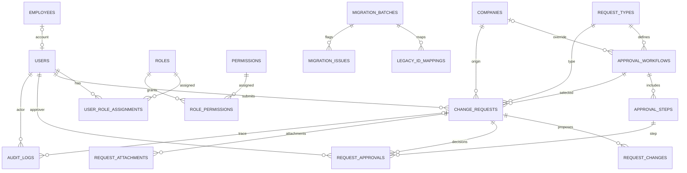
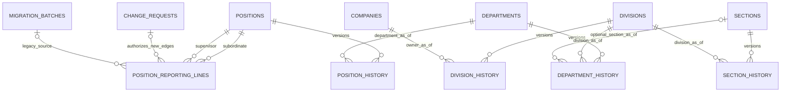
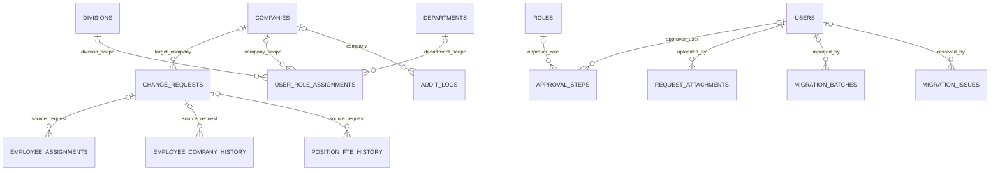
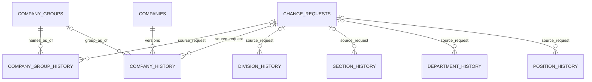

# Roster Master — ER Diagram (R2.1)
Source: baseline `001_schema.sql`; dotted/proposed logical entities described separately. Mermaid represents relationships, not executable SQL or a claim of implemented constraints.

## Existing organization and workforce

## Existing access, approvals, audit and migration

## Proposed R2 logical relationship (NOT IN BASELINE SQL)

Notes: Revision 4 replaces the former conceptual organization ownership placeholder with explicit effective-dated group/company/division/section/department/position history. See the revised diagram and DATA_DICTIONARY for temporal rules.

## Revision 3 — remaining baseline FK edges (supplement to current diagrams)

All 13 above are EXISTING FK edges omitted from earlier diagrams, not new constraints. Polymorphic references `request_changes.entity_id`, `legacy_id_mappings.new_id` and `audit_logs.entity_id` do not have database FK constraints. Composite FKs (department section/division and change-request workflow/type) are not fully expressible as Mermaid edges; refer to SQL. Proposed effective-dated version edges and `position_reporting_lines` do not exist in 001. For current chart `positions.parent_position_id` remains a baseline column; in R2 it is proposed as read-only derived current PRIMARY supervisor from approved reporting-line history. Historical organization names are drawn from versioned entities at report date.

## Revision 4 — proposed name history and provenance edges (NOT in baseline SQL)

All edges in this block are PROPOSED, not baseline FKs. New approved history records must carry approval provenance; audited migration baselines may instead use explicit migration provenance (final column shapes TBD). Current names/status and parent_position_id are derived projections, never authoritative for as-of reports or RLS. Root designation is effective-dated and approved per position; a root has no PRIMARY supervisor. Every new reporting edge needs approval; legacy imported edges use migration provenance exclusively.

## Revision 5 — multi-company approval, migration provenance and root designation (proposed)

```mermaid
erDiagram
 CHANGE_REQUESTS ||--o{ REQUEST_AFFECTED_COMPANIES : affects
 COMPANIES ||--o{ REQUEST_AFFECTED_COMPANIES : must_approve
 CHANGE_REQUESTS ||--o{ REQUEST_APPROVAL_STEP_INSTANCES : instantiates
 COMPANIES ||--o{ REQUEST_APPROVAL_STEP_INSTANCES : required_company
 APPROVAL_STEPS ||--o{ REQUEST_APPROVAL_STEP_INSTANCES : template
 REQUEST_APPROVAL_STEP_INSTANCES ||--o{ REQUEST_APPROVALS : decisions
 CHANGE_REQUESTS ||--o{ REQUEST_APPLY_LEDGER : applies_once
 MIGRATION_BATCHES o|--o{ COMPANY_GROUP_HISTORY : migration_provenance
 MIGRATION_BATCHES o|--o{ COMPANY_HISTORY : migration_provenance
 MIGRATION_BATCHES o|--o{ DIVISION_HISTORY : migration_provenance
 MIGRATION_BATCHES o|--o{ SECTION_HISTORY : migration_provenance
 MIGRATION_BATCHES o|--o{ DEPARTMENT_HISTORY : migration_provenance
 MIGRATION_BATCHES o|--o{ POSITION_HISTORY : migration_provenance
 MIGRATION_BATCHES o|--o{ EMPLOYEE_COMPANY_HISTORY : migration_provenance
 MIGRATION_BATCHES o|--o{ EMPLOYEE_ASSIGNMENTS : migration_provenance
 MIGRATION_BATCHES o|--o{ POSITION_FTE_HISTORY : migration_provenance
```

`POSITION_HISTORY.is_root` is an attribute, not an FK edge. `REQUEST_APPROVALS.workflow_id` is proposed to have composite FK to both request and approval step workflow; Mermaid cannot encode composite key membership accurately. For `COMPANY_HISTORY.company_group_id`, group is OPTIONAL pending explicit business decision; the baseline company.group_id is nullable. All above are proposed, not implemented. Revision 6 replaces the separate request_company_approvals table with per-company step instances; request_approvals is the single evidence table.

## Revision 6 lifecycle notes
Approved future history is committed at final approval. A new approved compensating request supersedes future intervals without deleting original approval/audit provenance. Role grants at division/department scope retain granted_owner_company_id and are denied immediately if the effective owner changes. Employee status cancelled excludes HC and forbids effective non-cancelled assignments. These are proposed attributes/rules, not baseline SQL.
